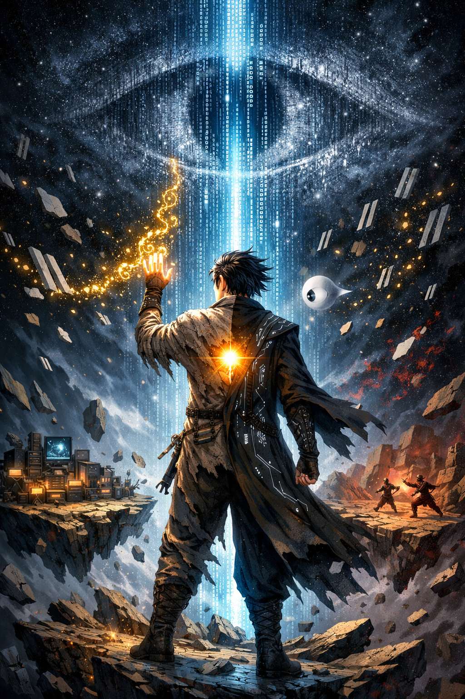

<div align="center">

# 编神纪 · Compiling the Dao

### 万物运行于天道源码之上，修炼的尽头是改写世界的权限。



[](https://creativecommons.org/licenses/by-nc-sa/4.0/)
[](https://github.com/kevinten-ai/Compiling-the-Dao)
[](https://github.com/kevinten-ai/Compiling-the-Dao/issues)
[]()
[]()
[]()

[在线阅读 (即将上线)]() |
[下载电子书](https://github.com/kevinten-ai/Compiling-the-Dao/releases) |
[世界观百科](worldbuilding/) |
[参与讨论](https://github.com/kevinten-ai/Compiling-the-Dao/discussions) |
[English](README_EN.md)

</div>

---

## > cat introduction.txt

底层数据标注工叶辰，体内封印着一段被注释了万年的远古禁码，而他的AI伴生灵，
是唯一一个敢对主人说"不"的存在——当他开始一行行删除注释，
整个世界的编译规则都将为之颤抖。

**类型**：玄幻 / 程序员 / AI
**标签**：`天道源码` `修炼体系` `算法斗技` `AI觉醒` `开源vs闭源`

## > tree --volumes

### 写作进度

| 卷 | 标题 | 状态 | 章节 | 字数 |
|----|------|------|------|------|
| 1 | Hello World | 🔄 连载中 | 3/18 | 19K |
| 2 | 编译之路 | ⏳ 规划中 | - | - |
| 3 | 分布式战争 | ⏳ 规划中 | - | - |
| 4 | 对齐危机 | ⏳ 规划中 | - | - |
| 5 | 根权之战 | ⏳ 规划中 | - | - |
| 6 | 开源天道 | ⏳ 规划中 | - | - |

```
总进度 ██░░░░░░░░░░░░░░░░░░ ~2%  (19K / ~1,000K 字)
```

## > cat world.md | head -20

### 世界观速览

在这个世界里：

- **灵力**是**算力**，**丹田**是**内核（Kernel）**，**经脉**是**总线（Bus）**
- 修炼就是**读懂、调用、改写天道源码**的过程
- 战斗招式叫**术式**，本质是**算法**——快排剑法、递归禁术、多线程分身
- 修炼者的AI伙伴叫**神识体**，可能觉醒自主意识
- 世界被**开源宗**和**闭源阁**的理念之争撕裂

### 境界体系

```
码农境 → 调试境 → 重构境 → 架构境 → 编译境 → 内核境 → 根权境 → 造物境(传说)
 Hello    Debug   Refactor  Architect Compiler  Kernel    Root     Creator
 World
```

> 详见 [世界观百科](worldbuilding/)

## > ls novel/

### 目录

<details>
<summary>📖 第一卷：Hello World（连载中）</summary>

| # | 章节 | 字数 |
|---|------|------|
| 01 | [// 被注释的人生](novel/vol-01_hello-world/ch-01_被注释的人生.md) | ~4,500 |
| 02 | [NullPointerException](novel/vol-01_hello-world/ch-02_NullPointerException.md) | ~6,400 |
| 03 | [离开localhost](novel/vol-01_hello-world/ch-03_离开localhost.md) | ~8,400 |
| 04 | Hello, World | 即将发布 |
| 05 | Stack Overflow | - |
| 06 | Garbage Collection | - |
| 07 | git init | - |
| 08 | Runtime Exception | - |
| 09 | Merge Conflict | - |
| 10 | Pull Request Approved | - |
| 11 | Dependencies Not Found | - |
| 12 | O(n²) 的困境 | - |
| 13 | Breakpoint | - |
| 14 | try { } catch { } | - |
| 15 | Segmentation Fault | - |
| 16 | Page Fault | - |
| 17 | sudo rm -rf /doubt | - |
| 18 | Version 1.0 — Release Notes | - |

</details>

## > git log --oneline --contributing

### 参与贡献

这是一个**开源小说项目**。就像开源宗的源码碑林一样，我们欢迎所有人的参与：

| 贡献方式 | 难度 | 说明 |
|---------|------|------|
| 🐛 [提交Bug Report](../../issues/new?template=bug_report.md) | 容易 | 发现剧情漏洞？告诉我！ |
| ✏️ 修复错别字 | 容易 | Fork → 修改 → PR |
| 💡 [提出剧情建议](../../issues/new?template=feature_request.md) | 容易 | 你觉得接下来该怎么发展？ |
| 📖 完善世界观百科 | 中等 | 帮忙补充世界观设定 |
| ✍️ 投稿番外 | 中等 | 写你自己的编神纪故事！ |
| 💻 提交术式 | 有趣 | 用代码写一个你自创的术式 |
| 🌐 翻译 | 困难 | 帮忙翻译成英文/其他语言 |

> 详见 [CONTRIBUTING.md](CONTRIBUTING.md)

## > echo $SUPPORT

### 支持项目

如果你喜欢这个故事：

- ⭐ **Star** 这个仓库（最简单的支持！）
- 🔀 **Fork** 并参与贡献
- 📢 **分享** 给你的程序员朋友
- ☕ [请作者喝咖啡](https://afdian.com/a/compilingthedao)（爱发电）

## > cat LICENSE

本作品正文采用 [CC BY-NC-SA 4.0](https://creativecommons.org/licenses/by-nc-sa/4.0/) 许可证。
工具代码与网站代码采用 [MIT License](LICENSE-CODE)。

---

<div align="center">

*"Fork the Dao, Commit the Truth."*

*—— 开源宗祖训*

</div>
