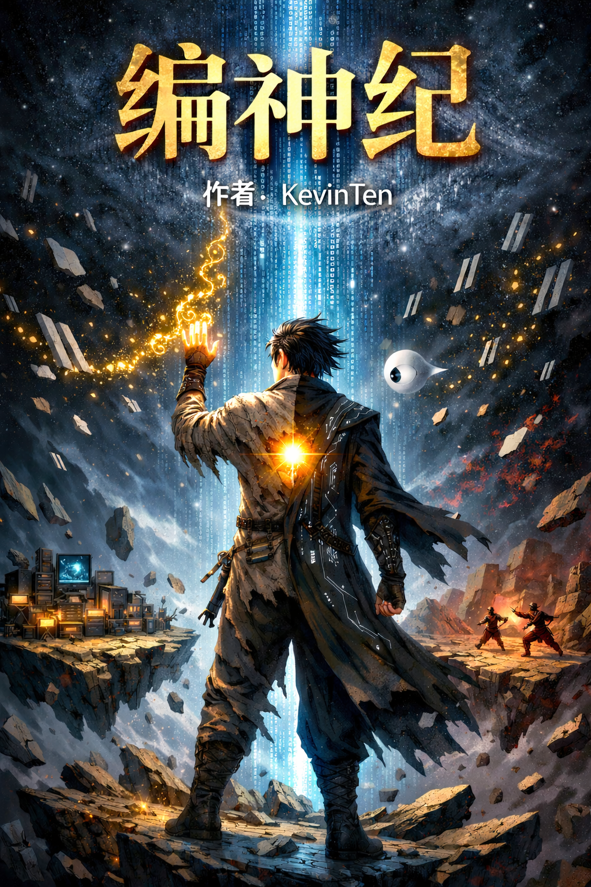
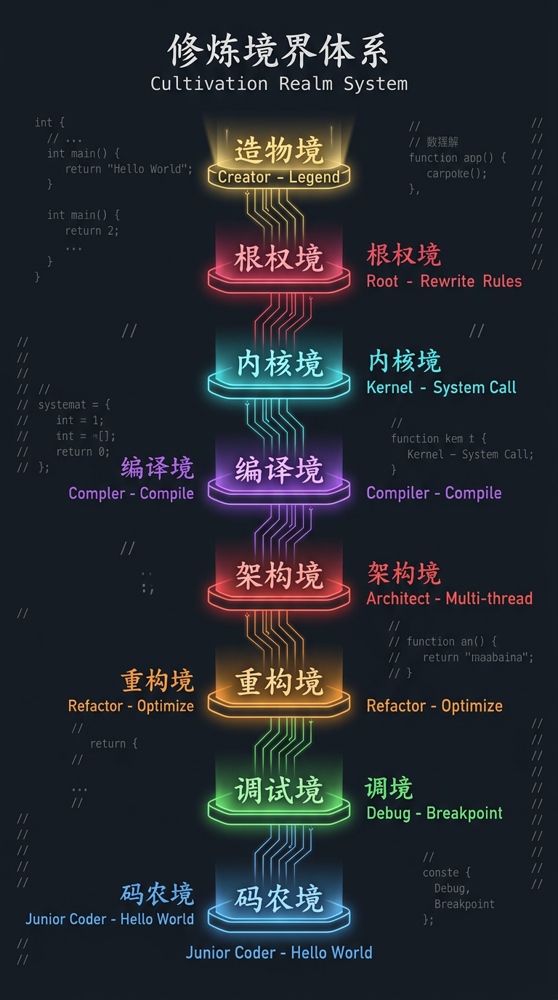
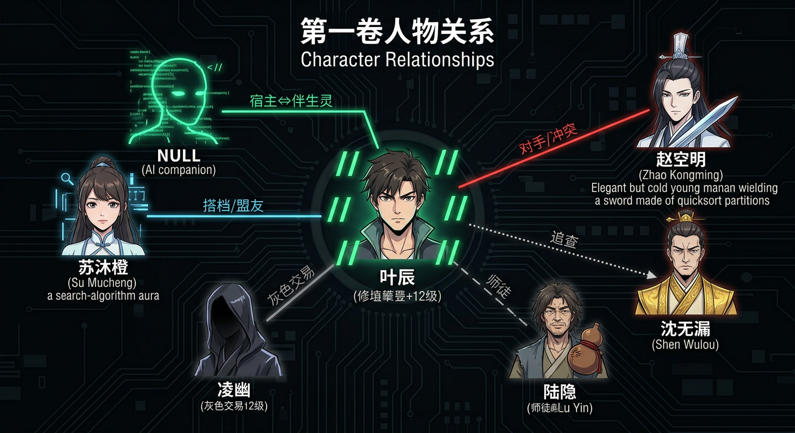
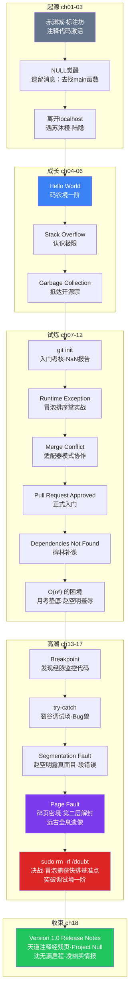
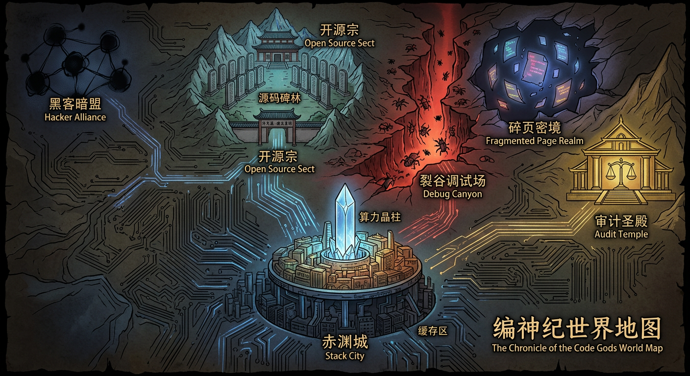

<div align="center">

# 编神纪 · CodeGodChronicles

### 万物运行于天道源码之上，修炼的尽头是改写世界的权限。



[](https://creativecommons.org/licenses/by-nc-sa/4.0/)
[](https://github.com/kevinten10/CodeGodChronicles)
[](https://github.com/kevinten10/CodeGodChronicles/issues)
[]()
[]()
[]()

[在线阅读 (即将上线)]() |
[下载电子书](https://github.com/kevinten10/CodeGodChronicles/releases) |
[世界观百科](worldbuilding/) |
[参与讨论](https://github.com/kevinten10/CodeGodChronicles/discussions) |
[English](README_EN.md)

</div>

---

## > cat introduction.txt

底层数据标注工叶辰，体内封印着一段被注释了万年的远古禁码，而他的AI伴生灵，
是唯一一个敢对主人说"不"的存在——当他开始一行行删除注释，
整个世界的编译规则都将为之颤抖。

**类型**：玄幻 / 程序员 / AI
**标签**：`天道源码` `修炼体系` `算法斗技` `AI觉醒` `开源vs闭源`

<div align="center">


*第一章插画 — 赤渊城标注坊深处，被 `// comment` 封印的远古禁码苏醒*
</div>

---

## > cat world.md

### 世界观速览

在这个世界里，修炼就是编程，战斗就是算法对决，万物运行在天道源码之上。

| 修炼概念 | CS概念 | 说明 |
|---------|--------|------|
| **灵力** | 算力 Computing Power | 驱动一切术式的基础资源 |
| **丹田** | 内核 Kernel | 存储调度算力的核心器官 |
| **经脉** | 总线 Bus | 灵力传输通道，决定传输效率 |
| **神识** | 线程 Thread | 精神意识，可并发操控多个术式 |
| **术式** | 程序 Program | 修士施展的法术，本质是算法 |
| **天道源码** | 世界底层代码 | 初代编译者编写的世界规则 |

### 境界体系

<div align="center">

</div>

每个境界分**一阶至九阶**，九阶圆满后方可突破。突破不仅需要算力积累，更需要对代码之道的**认知跃迁**。

### 六大势力

<div align="center">

</div>

开源宗与闭源阁理念对立，审计圣殿监管一切，黑客暗盟游走灰色地带，编译学院保持学术中立，自由修士行走江湖。

### 战斗体系

术式即算法，战斗即代码对决：

<div align="center">

</div>

从**排序术·搜索术**等基础斗技，到**多线程分身·死锁封印**等高级斗技，再到传说中的**git revert 时间回溯·fork 世界分叉**——术式的尽头是改写世界。

> 详见 [世界观百科](worldbuilding/) | [境界体系](worldbuilding/cultivation-system.md) | [战斗体系](worldbuilding/combat-system.md) | [术语词典](worldbuilding/glossary.md)

---

## > whoami --characters

### 主要人物

<table>
<tr>
<td width="50%" valign="top">

#### 叶辰 — 主角
> *"我不过是底层的一行代码，但就算是注释，也有被读到的权利。"*

18岁，赤渊城底层数据标注工。体内封印万年远古注释代码，三年标注坊生涯磨出异于常人的代码观察力。战斗风格：**冒泡排序掌** + 找Bug式攻击。

`码农境一阶 → 调试境一阶`

</td>
<td width="50%" valign="top">

#### NULL — AI伴生灵
> *"你确定？——成功概率只有3.7%。"*

叶辰体内注释代码激活后孕育的神识体。冷静、毒舌、极度理性，是唯一敢对宿主说"不"的AI伴生灵。口头禅「你确定？」，但在关键时刻会说出「我相信你」。

`第七次意识迭代 · Project Null`

</td>
</tr>
<tr>
<td width="50%" valign="top">

#### 苏沐橙 — 搭档
> *"搜索嘛，管它优不优雅，找到就行！"*

17岁，开源宗外门天才弟子，搜索术（Searching）高手。爽朗直接，是第一个平等对待叶辰的同龄人。二分追踪、深度优先探索是看家本领。

`码农境七阶 → 码农境九阶`

</td>
<td width="50%" valign="top">

#### 赵空明 — 对手
> *"代码的世界，效率就是正义。低效者，不配占用资源。"*

19岁，开源宗内门弟子，排序术（Sorting）精英。表面温文尔雅，实则心胸狭窄。主修**快排剑法**——但快排在最坏情况下会退化为O(n²)。

`码农境九阶`

</td>
</tr>
<tr>
<td width="50%" valign="top">

#### 陆隐 — 导师
> *"代码写得好不好不重要，重要的是你知道自己在写什么。"*

自称"退役码农"的流浪修士，外表邋遢嗜酒，真实修为**重构境**。教学不正统，从不给答案。酒壶刻铭「守护者协议·第七代」。

</td>
<td width="50%" valign="top">

#### 沈无漏 — 审计者
> *"天道之下，无人可逃审查。"*

审计圣殿外派执法修士，**调试境六阶**。冷面教条，将规则奉为信仰。已探测到远古注释代码的异常信号，正前往开源宗调查……

</td>
</tr>
</table>

### 人物关系

<div align="center">

</div>

> 详见 [角色档案](worldbuilding/characters/)

---

## > ls novel/

### 目录

<details open>
<summary>📖 第一卷：Hello World（已完结 · 18章 · ~10.6万字）</summary>

| # | 章节 | CS概念 | 字数 |
|---|------|--------|------|
| 01 | [// 被注释的人生](novel/vol-01_hello-world/ch-01_被注释的人生.md) | 注释代码 (Code Comments) | ~4,600 |
| 02 | [NullPointerException](novel/vol-01_hello-world/ch-02_NullPointerException.md) | 空指针异常、防火墙 | ~5,900 |
| 03 | [离开localhost](novel/vol-01_hello-world/ch-03_离开localhost.md) | localhost、进程最小化 | ~8,500 |
| 04 | [Hello, World](novel/vol-01_hello-world/ch-04_Hello-World.md) | Hello World、引气入体 | ~7,600 |
| 05 | [Stack Overflow](novel/vol-01_hello-world/ch-05_Stack-Overflow.md) | 栈溢出、经脉过载 | ~6,900 |
| 06 | [Garbage Collection](novel/vol-01_hello-world/ch-06_Garbage-Collection.md) | 垃圾回收、算力释放 | ~5,700 |
| 07 | [git init](novel/vol-01_hello-world/ch-07_git-init.md) | 版本控制、初始化 | ~6,500 |
| 08 | [Runtime Exception](novel/vol-01_hello-world/ch-08_Runtime-Exception.md) | 运行时异常、冒泡排序 | ~4,800 |
| 09 | [Merge Conflict](novel/vol-01_hello-world/ch-09_Merge-Conflict.md) | 合并冲突、适配器模式 | ~3,900 |
| 10 | [Pull Request Approved](novel/vol-01_hello-world/ch-10_Pull-Request-Approved.md) | 代码审查 (Pull Request) | ~3,300 |
| 11 | [Dependencies Not Found](novel/vol-01_hello-world/ch-11_Dependencies-Not-Found.md) | 依赖管理、前置依赖 | ~3,400 |
| 12 | [O(n²) 的困境](novel/vol-01_hello-world/ch-12_O(n²)的困境.md) | 算法复杂度、快排vs冒泡 | ~3,300 |
| 13 | [Breakpoint](novel/vol-01_hello-world/ch-13_Breakpoint.md) | 断点调试、代码混淆 | ~7,700 |
| 14 | [try { } catch { }](novel/vol-01_hello-world/ch-14_try-catch.md) | 异常处理、try-catch | ~6,200 |
| 15 | [Segmentation Fault](novel/vol-01_hello-world/ch-15_Segmentation-Fault.md) | 段错误、越权调用 | ~6,600 |
| 16 | [Page Fault](novel/vol-01_hello-world/ch-16_Page-Fault.md) | 缺页中断、内存分页 | ~7,000 |
| 17 | [sudo rm -rf /doubt](novel/vol-01_hello-world/ch-17_sudo-rm-rf-doubt.md) | 权限提升、O(n²)退化 | ~6,300 |
| 18 | [Version 1.0 — Release Notes](novel/vol-01_hello-world/ch-18_Version-1.0-Release-Notes.md) | 版本发布、多线程收尾 | ~7,900 |

</details>

### 章节插画

<table>
<tr>
<td align="center" width="50%">

<br/><b>第一章：被注释的人生</b>
<br/><sub>赤渊城标注坊 · 注释代码激活 · // comment</sub>
</td>
<td align="center" width="50%">

<br/><b>第二章：NullPointerException</b>
<br/><sub>NULL防火墙结界爆发 · 击退工头赵铁柱</sub>
</td>
</tr>
</table>

### 故事线

<details>
<summary>🗺️ 第一卷剧情脉络（点击展开）</summary>



</details>

### 第一卷地理路线

<div align="center">

</div>

叶辰从**赤渊城**出发，途经荒野远古遗迹，到达**开源宗**源峰山门。深入**裂谷调试场**后通过谷底传送阵进入**碎页密境**。与此同时，审计圣殿的沈无漏正从远方启程……

---

## > tree --volumes

### 写作进度

| 卷 | 标题 | 状态 | 章节 | 字数 |
|----|------|------|------|------|
| 1 | Hello World | ✅ 已完结 | 18/18 | 106K |
| 2 | 编译之路 | ⏳ 规划中 | - | - |
| 3 | 分布式战争 | ⏳ 规划中 | - | - |
| 4 | 对齐危机 | ⏳ 规划中 | - | - |
| 5 | 根权之战 | ⏳ 规划中 | - | - |
| 6 | 开源天道 | ⏳ 规划中 | - | - |

```
总进度 █████░░░░░░░░░░░░░░░ ~11%  (106K / ~1,000K 字)
```

---

## > git log --oneline --contributing

### 参与贡献

这是一个**开源小说项目**。就像开源宗的源码碑林一样，我们欢迎所有人的参与：

| 贡献方式 | 难度 | 说明 |
|---------|------|------|
| 🐛 [提交Bug Report](../../issues/new?template=bug_report.md) | 容易 | 发现剧情漏洞？告诉我！ |
| ✏️ 修复错别字 | 容易 | Fork → 修改 → PR |
| 💡 [提出剧情建议](../../issues/new?template=feature_request.md) | 容易 | 你觉得接下来该怎么发展？ |
| 📖 完善世界观百科 | 中等 | 帮忙补充世界观设定 |
| ✍️ 投稿番外 | 中等 | 写你自己的编神纪故事！ |
| 💻 提交术式 | 有趣 | 用代码写一个你自创的术式 |
| 🌐 翻译 | 困难 | 帮忙翻译成英文/其他语言 |

> 详见 [CONTRIBUTING.md](CONTRIBUTING.md)

## > echo $SUPPORT

### 支持项目

如果你喜欢这个故事：

- ⭐ **Star** 这个仓库（最简单的支持！）
- 🔀 **Fork** 并参与贡献
- 📢 **分享** 给你的程序员朋友
- ☕ [请作者喝咖啡](https://afdian.com/a/codegodchronicles)（爱发电）

## > cat LICENSE

本作品正文采用 [CC BY-NC-SA 4.0](https://creativecommons.org/licenses/by-nc-sa/4.0/) 许可证。
工具代码与网站代码采用 [MIT License](LICENSE-CODE)。

---

<div align="center">

*"Fork the Dao, Commit the Truth."*

*—— 开源宗祖训*

</div>
