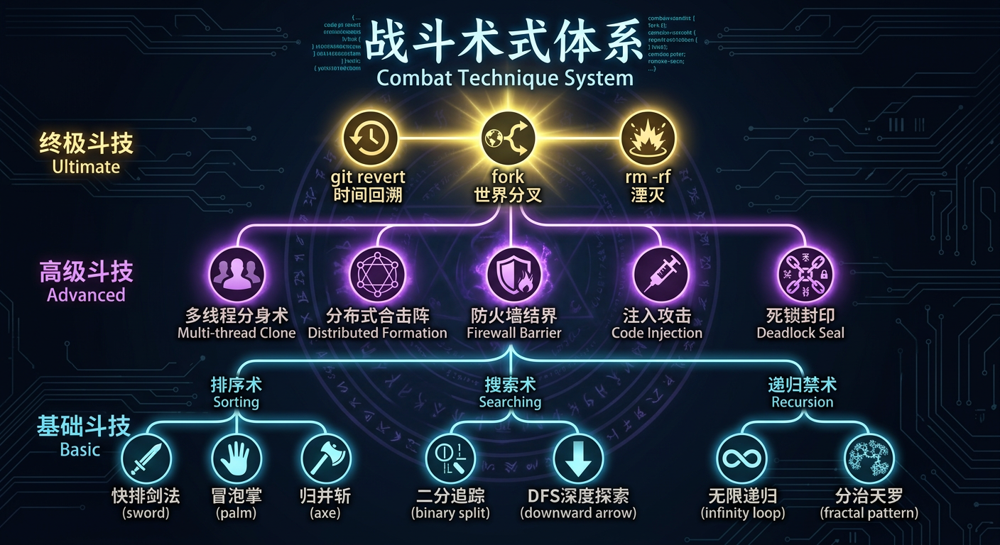
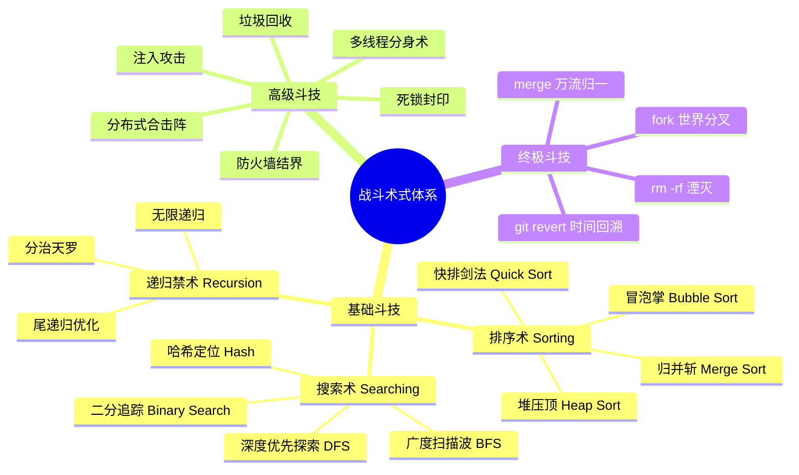

# 战斗术式体系 — Combat Technique System

> 天下术式，不过是对天道源码的不同调用方式罢了。

修士的战斗术式（Combat Techniques）本质上是对天道源码的调用与执行。术式按威力与复杂度分为**基础斗技、高级斗技、终极斗技**三大层次，其中基础斗技又以不同的**算法流派**进行分类。

---

## 一、基础斗技 — 算法流派

基础斗技是每位修士的立身之本，以经典算法为核心，衍生出各类攻防手段。

### 1. 排序术（Sorting Techniques）

以排序算法为核心的战斗流派，擅长**调整、重组**对手的攻击序列与防御结构。

| 术式名称 | 对应算法 | 效果描述 |
|---------|---------|---------|
| **快排剑法** | 快速排序（Quick Sort） | 剑气以"分治"之法切割空间，选定基准点后将一切攻击分列两侧，逐层击破。出剑极快，平均效率极高，但遇到特定阵型（已排序序列）时可能退化。 |
| **冒泡掌** | 冒泡排序（Bubble Sort） | 掌力层层推进，每一击将最大的威胁"冒"至最外层逐一击破。虽然效率不高，但胜在稳定可靠，是码农境修士最常修习的入门斗技。 |
| **归并斩** | 归并排序（Merge Sort） | 将攻击分为多段独立执行后再合并为一击。稳定且威力恒定，适合团战中的协同攻击。 |
| **堆压顶** | 堆排序（Heap Sort） | 构建灵力堆结构，始终将最强一击置于顶端随时释放。防御中蕴含反击，攻守兼备。 |

### 2. 搜索术（Searching Techniques）

以搜索算法为核心的战斗流派，擅长**追踪、定位、侦查**。

| 术式名称 | 对应算法 | 效果描述 |
|---------|---------|---------|
| **二分追踪** | 二分搜索（Binary Search） | 每次将搜索范围缩小一半，极速锁定目标位置。用于战斗时可快速找到对手的弱点，但要求对手的"数据"必须有序。 |
| **深度优先探索** | 深度优先搜索（DFS） | 沿一条路径极限深入，直到触底后回溯。用于探索未知区域或破解层层嵌套的阵法，但可能陷入死胡同。 |
| **广度扫描波** | 广度优先搜索（BFS） | 以自身为中心向四周扩散感知波，逐层探索。适合大范围侦查，但算力消耗随范围指数增长。 |
| **哈希定位** | 哈希查找（Hash Lookup） | 通过特殊的"哈希函数"直接定位目标，几乎瞬间完成。但需要预先建立哈希映射，且存在"碰撞"风险。 |

### 3. 递归禁术（Recursion Forbidden Arts）

以递归为核心的禁忌术式，威力强大但风险极高。

| 术式名称 | 说明 |
|---------|------|
| **无限递归** | 对目标施加自我调用的术式，使其陷入无限循环直至算力耗尽（栈溢出）。被列为禁术，因为施术者若控制不当也会反噬。 |
| **尾递归优化** | 递归禁术的安全版本，通过特殊的优化手法避免栈溢出的风险。仅有少数高手掌握。 |
| **分治天罗** | 将问题（敌人）递归地分解为更小的子问题分别击破，最终合并结果。需要极强的神识来维持递归树的展开。 |

---

## 二、高级斗技 — 架构级术式

高级斗技需要**架构境**及以上修为方可施展，涉及系统层面的概念，威力远超基础斗技。

| 术式名称 | 对应概念 | 效果描述 |
|---------|---------|---------|
| **多线程分身术** | 多线程（Multi-threading） | 分裂出多个独立行动的分身，每个分身可执行不同的术式。分身数量取决于神识（线程数）的上限。但分身间需要"同步"，否则可能出现冲突。 |
| **分布式合击阵** | 分布式系统（Distributed System） | 多名修士组成阵法，将算力通过网络协议整合为一体，发出超越个体极限的合击。阵法的威力取决于节点数量与通信效率。 |
| **垃圾回收** | 垃圾回收（Garbage Collection） | 主动回收战场上残留的废弃算力碎片，转化为自身的补给。持久战中的关键技能，但执行时会导致短暂的"停顿（Stop-the-World）"。 |
| **防火墙结界** | 防火墙（Firewall） | 建立规则化的防御屏障，自动过滤、拦截不符合规则的攻击。可设定白名单与黑名单，但可能被高级注入攻击突破。 |
| **注入攻击** | 代码注入（Code Injection） | 将自己编写的恶意代码片段注入对手的术式之中，篡改其执行逻辑。黑客暗盟的标志性攻击手段，被正道修士所不齿。 |
| **死锁封印** | 死锁（Deadlock） | 使两个或多个目标互相等待对方释放资源，导致所有目标永久停滞。极其阴险的封印术，但布置条件苛刻，需要精确操控多个资源的分配顺序。 |
| **缓存护盾** | 缓存（Cache） | 将常用的防御术式缓存在经脉中，遇到相同攻击时瞬间响应。但缓存容量有限，且存在"缓存失效"的风险。 |
| **异步突袭** | 异步编程（Async） | 发出攻击后不等待结果，立即执行下一步行动。对手难以预判攻击节奏，但需要精确的"回调"机制来处理结果。 |

---

## 三、终极斗技 — 天道级术式

终极斗技触及天道源码的核心功能，仅**根权境**及以上方可尝试施展，威力足以改变世界的局部规则。

| 术式名称 | 对应概念 | 效果描述 |
|---------|---------|---------|
| **git revert — 时间回溯** | 版本回退（Git Revert） | 将一定范围内的时间"回退"到之前的版本，撤销已经发生的事件。不是真正的时间倒流，而是创造一个"反向提交（Reverse Commit）"来抵消变更。代价极其巨大，且无法回退其他根权境修士的操作。 |
| **fork — 世界分叉** | 分叉（Fork） | 将当前世界"分叉"为两个平行的版本，在分叉的世界中尝试不同的可能性。传说中造物境的术式，目前无人能完整施展。据说初代编译者曾用此术创造了多个平行世界。 |
| **merge — 万流归一** | 合并（Merge） | 将两条分叉的世界线重新合并为一。合并时可能产生"冲突（Conflict）"，需要手动解决，否则会导致世界规则的混乱。 |
| **rm -rf — 湮灭** | 强制删除（rm -rf） | 不可逆地删除一切目标的存在，从天道源码中彻底抹去。最为恐怖的毁灭性术式，传说初代编译者以此终结了上一个纪元。 |

---

## 术式品阶

所有术式按品质分为以下等级：

| 品阶 | 对应 | 说明 |
|------|------|------|
| **白板** | 无注释的代码 | 最基础的术式，几乎人人可学 |
| **注释级** | 有注释的代码 | 附带理解说明，学习效率更高 |
| **文档级** | 有完整文档 | 经过系统整理的术式，包含使用方法与注意事项 |
| **框架级** | 框架（Framework） | 可扩展、可复用的术式体系，具有极高的架构价值 |
| **内核级** | 内核代码 | 触及天道底层的术式，威力巨大但理解门槛极高 |
| **源码级** | 天道源码 | 直接调用天道源码的术式，传说中的存在 |
