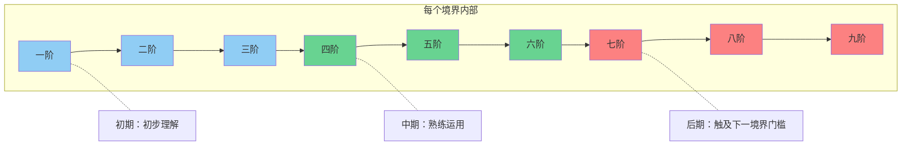

# 修炼境界体系 — Cultivation Realm System

> 修炼之道，始于Hello World，终于造物。

本世界的修炼体系分为**八大境界**，每个境界对应计算机科学中的一个核心阶段。修士从最底层的码农境起步，逐步深入天道源码的底层，直至传说中可以从零创造世界的造物境。每个境界内部又细分为**一阶到九阶**，九阶圆满后方可尝试突破下一境界。

### 阶位进度示意

---

## 八大修炼境界

| 境界 | 对应概念 | 能力描述 |
|------|---------|---------|
| **码农境** | 初级码农（Junior Coder） | 修炼的起点。能感知算力（Computing Power），编写最简单的术式，如同写出第一行 `Hello World`。此境界的修士数量最多，是修炼世界的基石。 |
| **调试境** | 调试（Debug） | 能发现并修复术式中的缺陷（Bug），看破低级幻术。拥有"断点感知"的能力，可以在战斗中捕捉对手术式的漏洞并加以利用。 |
| **重构境** | 重构（Refactor） | 能优化自身术式结构，使相同的术式以更少的算力发挥更强的效果。战斗效率发生质变，真正跻身强者之列。 |
| **架构境** | 架构师（Architect） | 能设计复杂的术式体系，操控**多线程（Multi-thread）**同时战斗。可构建术式框架，指挥他人协同作战。此境界开始接触天道源码的表层。 |
| **编译境** | 编译器（Compiler） | 能将高级术式瞬间编译为底层指令，施法速度碾压低境界修士。理解高级抽象与底层执行之间的映射关系，攻击直达本质。 |
| **内核境** | 内核（Kernel） | 触及天道源码的外层接口（API），拥有操控世界规则的雏形之力。可调用天道提供的系统级函数，干预局部自然法则。 |
| **根权境** | 超级权限（Root） | 获得天道的超级权限（Root Access），可改写局部世界法则。在一定范围内如同天道的代言人，拥有近乎神明的力量。 |
| **造物境（传说）** | 造物者/神（Creator/God） | 初代编译者的境界。可从零编写一个世界的源码，创造完整的世界。此境界仅存于传说之中，万年以来无人达到。 |

---

## 境界突破机制

### 突破条件

每个境界的突破不仅需要**算力积累**（量变），更需要**对代码之道的领悟**（质变）：

- **码农境 → 调试境**：需要在实战中发现并成功修复一个真实的术式Bug，领悟"代码不可能完美"的道理。
- **调试境 → 重构境**：需要将自身某个核心术式彻底重构，在不改变外部效果的前提下实现内部结构的优化。
- **重构境 → 架构境**：需要设计一套完整的术式体系，并成功驱动多线程并行运作。
- **架构境 → 编译境**：需要理解术式从高级语言到底层指令的完整编译流程，打通"抽象"与"执行"的壁障。
- **编译境 → 内核境**：需要触及天道源码的外层接口，成功调用至少一个系统级函数。
- **内核境 → 根权境**：需要获得天道的认证，通过某种未知的"权限验证"。
- **根权境 → 造物境**：传说中需要完全理解天道源码，并拥有从零编译世界的能力。条件不明。

### 阶位细分

每个境界内分为**一阶至九阶**：

- **一至三阶**：初期，刚踏入该境界，对本层级的核心概念有初步理解。
- **四至六阶**：中期，熟练运用本层级能力，可与同境界修士正面对抗。
- **七至九阶**：后期/巅峰，本层级能力运用炉火纯青，开始触及下一境界的门槛。

---

## 特殊状态

| 状态 | 说明 |
|------|------|
| **栈溢出（Stack Overflow）** | 修士强行运行超出自身算力承受范围的术式，导致经脉崩溃，轻则重伤，重则陨落。 |
| **死循环（Infinite Loop）** | 修士陷入某种术式的无限执行中无法自拔，神识被困，如不及时打断将导致神识消散。 |
| **内存泄漏（Memory Leak）** | 长期使用术式却未正确释放算力，导致修为缓慢流失，是许多修士不自知的慢性病。 |
| **蓝屏（Blue Screen）** | 丹田（内核）严重崩溃的极端状态，修士会陷入昏迷，需要外力"重启"。 |
