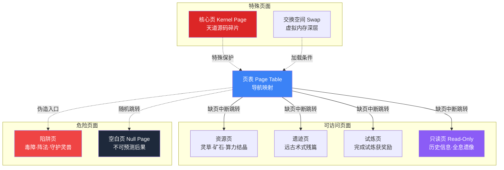

# 碎页密境 — Fragmented Page Realm

> "空间在此被分割为无数页面，每一页都是一个独立的世界碎片。"

碎页密境是隐藏在裂谷调试场深处的一片神秘秘境，其空间结构被分割为无数个独立的"页面（Page）"，对应计算机科学中的**内存分页（Memory Paging）**概念。这里蕴藏着远古时代遗留的宝贵资源与致命危险。

---

## 基本信息

| 项目 | 内容 |
|------|------|
| **名称** | 碎页密境 |
| **英文代号** | Fragmented Page Realm |
| **对应编程概念** | 内存分页（Memory Paging） |
| **入口位置** | 裂谷调试场最深处（Core Dump区域附近） |
| **危险等级** | 极高 |
| **发现状态** | 半公开（少数人知晓） |

---

## 空间结构

碎页密境最独特的特征是其空间被分割为无数独立的**"页面（Page）"**。每个页面都是一个相对独立的空间片段，拥有各自的环境、规则甚至时间流速。

### 页面特性

| 特性 | 说明 |
|------|------|
| **页面大小固定** | 每个页面的空间大小大致相同，如同内存中的固定页面大小 |
| **页面间跳转** | 从一个页面进入另一个页面需要找到"页表（Page Table）"中的映射入口 |
| **碎片化** | 页面之间的排列毫无规律，如同严重碎片化的磁盘——相邻的页面在逻辑上可能毫不相关 |
| **缺页异常（Page Fault）** | 试图访问不存在或被保护的页面时，会被强制弹出并受到灵力反噬 |
| **页面置换** | 密境中的页面并非恒定存在——某些页面会被"置换（Swap）"出去，换入新的页面，使得密境的地图永远在变化 |

---

## 页面类型

密境中的页面按内容分为多种类型：

| 页面类型 | 说明 |
|---------|------|
| **资源页** | 蕴含灵草、矿石、算力结晶等修炼资源 |
| **遗迹页** | 保存着远古修士的修炼遗迹、术式残篇或功法碎片 |
| **试炼页** | 自带试炼机制的页面，完成试炼可获得奖励 |
| **陷阱页** | 充满致命危险的页面——毒障、阵法、或强大的守护灵兽 |
| **空白页（Null Page）** | 完全空白的页面，什么都没有。触碰空白页可能导致不可预测的后果 |
| **只读页（Read-Only Page）** | 可以观察但无法改变其中任何事物的页面，通常保存着重要的历史信息 |
| **核心页（Kernel Page）** | 极为罕见，被特殊保护的页面。据说蕴含天道源码的底层碎片，拥有改写规则的力量 |

---

## 探索机制

### 页表导航

要在碎页密境中移动，必须掌握**页表（Page Table）**的使用方法。页表是一种特殊的导航术式，记录着各页面之间的映射关系。没有页表的修士只能在当前页面内活动，或者随机跳转到相邻页面（结果不可预测）。

### 碎片整理

高阶修士可以对密境中的页面进行有限的**碎片整理（Defragmentation）**——重新排列页面的逻辑顺序，使得相关的页面聚集在一起，方便探索。这需要极高的修为和对空间法则的理解。

### 虚拟内存

密境的实际空间远超表面可见的范围。大量页面被"存储"在更深层的空间中（如同硬盘上的虚拟内存/交换空间），需要特定条件才能被"加载"到可访问的区域。

---

## 已知危险

1. **页面置换风险**：修士所在的页面可能突然被置换出去，修士会被强制传送到未知位置。
2. **碎片化迷宫**：页面之间的混乱排列使得导航极其困难，容易迷失。
3. **缺页陷阱**：伪造的页表入口会触发缺页异常，造成灵力反噬。
4. **时间碎片**：不同页面中的时间流速不同，可能在密境中度过数日，外界已过数月。
5. **空间坍缩**：某些不稳定的页面会突然坍缩消失，在其中的一切将被湮灭。

---

## 故事意义

碎页密境是第一卷中叶辰重要的试炼场所，在这里他将面对空间谜题、资源争夺、以及与其他修士的冲突。密境的"分页"结构也暗示着这个世界的底层秘密——世界本身是否也只是天道源码中的一个"内存页面"？

---

## 第一卷故事事件

碎页密境在第一卷第15-17章中出现：

- **发现与进入**（ch15-16）：叶辰和苏沐橙通过谷底远古传送阵进入密境，利用缺页中断（Page Fault）进行页面间跳转导航
- **互补探索**（ch16）：苏沐橙的搜索术负责定位可访问页面，叶辰的注释代码负责解析页面中的隐藏信息——两人能力形成互补
- **远古全息遗像**（ch16）：在一个只读页面中发现远古修士的全息影像，该修士留下"真相藏在注释里"的讯息。NULL识别出该修士的编码风格与自己的"原始开发者"一致
- **注释代码第二层解封**（ch16）：叶辰的注释代码在密境中共鸣激活，解封第二层能力——代码混淆（Code Obfuscation）
- **传送阵被毁**（ch16-17）：赵空明从外部破坏传送阵，迫使叶辰和苏沐橙紧急撤离
