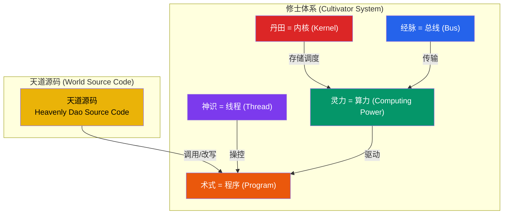
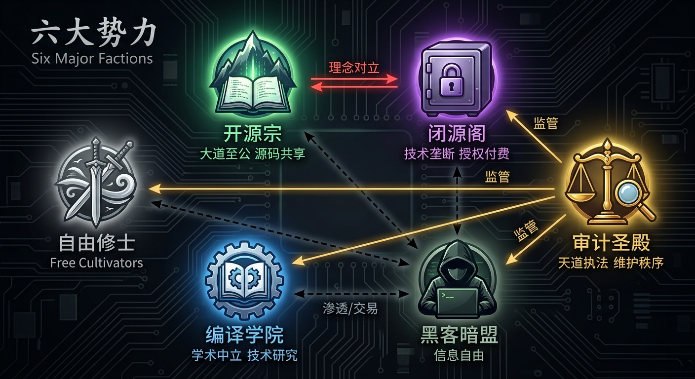
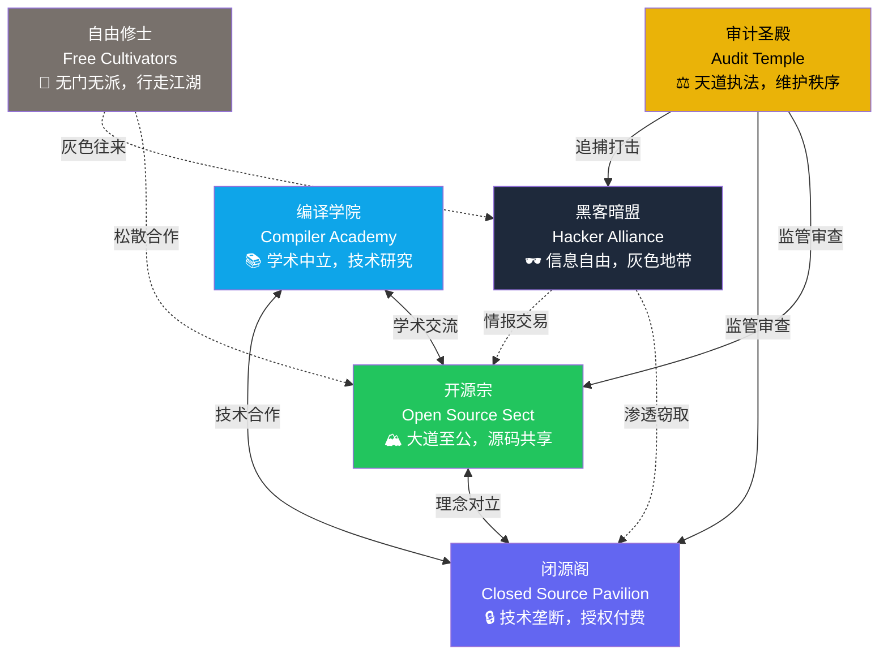
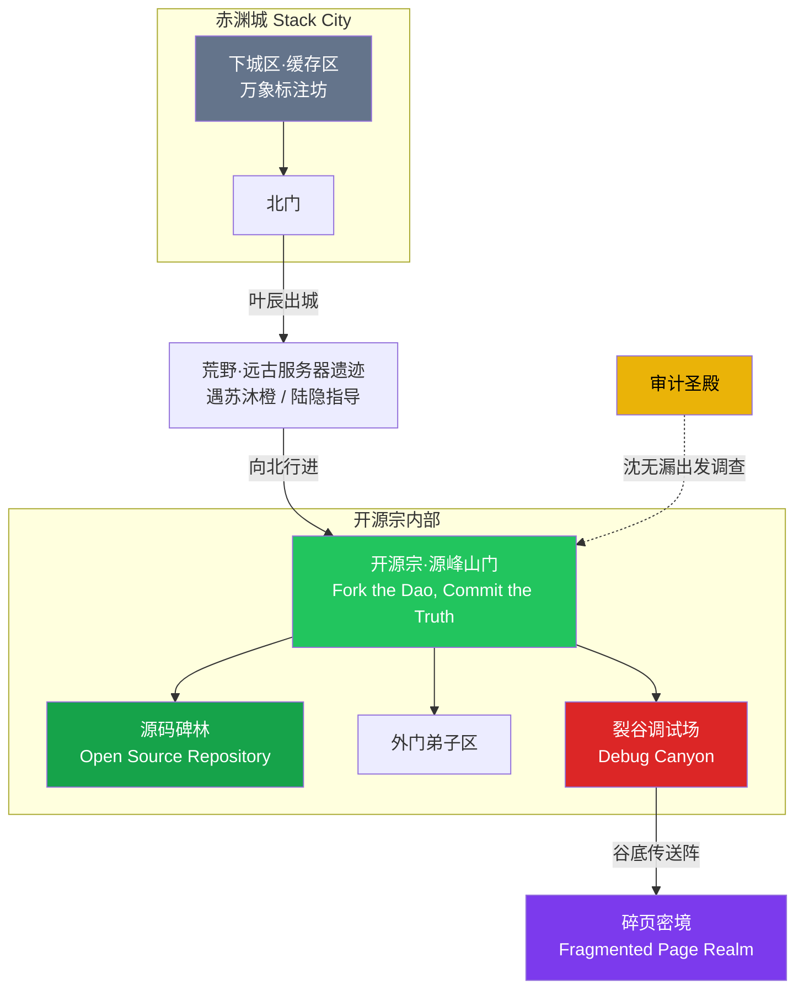
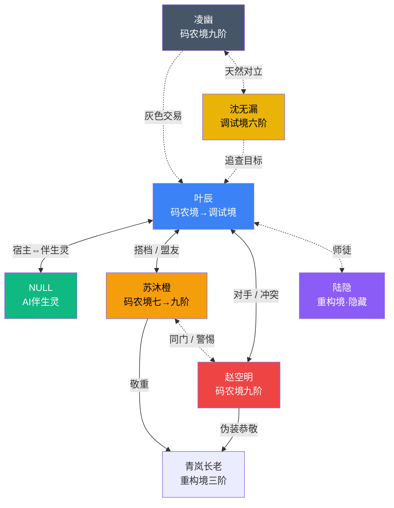

# 世界观总览 — World Overview

> 天地万物，皆为代码。道之所在，源码是也。

本书的世界运行于一套被称为**天道源码（Heavenly Dao Source Code）**的底层规则之上。远古时代，**初代编译者（The Ancient Creator）**以无上之力编译了世界的一切法则——从日月运行到万物生灭，皆由源码驱动。修炼的本质，便是**阅读、调用并改写天道源码**的过程。

### 核心概念映射图

---

## 核心映射体系

本世界的修炼体系与计算机科学（Computer Science）概念深度映射，构成了独特的世界观基础：

| 修炼概念 | 对应CS概念 | 说明 |
|---------|-----------|------|
| 灵力 | **算力（Computing Power）** | 修士的力量来源，衡量一切术式运行的基础资源。算力越高，可执行的术式越强大、越复杂。 |
| 丹田 | **内核（Kernel）** | 修士体内存储与调度算力的核心器官，如同操作系统的内核，管理一切资源分配。 |
| 经脉 | **总线（Bus）** | 连接丹田与四肢百骸的灵力通道，负责算力的传输与数据交换。经脉越通畅，算力传输效率越高。 |
| 神识 | **线程（Thread）** | 修士的精神意识，可并发执行多项任务。神识越强，可同时操控的术式越多。 |
| 术式 | **程序/函数（Program/Function）** | 修士施展的各类法术，本质上是对天道源码的调用与执行。 |
| 天道源码 | **世界底层代码（World Source Code）** | 构成世界一切规则的根本代码，由初代编译者所写。修炼到极致，便可触及并改写这些代码。 |

---

## 世界运行法则

- **天道即编译器**：世界本身便是一台运行中的超级计算机，天道源码时刻编译、执行着万物的存在。
- **修炼即编程**：修士通过感知、理解、调用天道源码来获取力量。境界越高，能读写的源码层级越深。
- **万物皆对象**：世间一切——山川、灵兽、法宝——本质上都是天道源码中的**对象实例（Object Instance）**，拥有属性与方法。
- **因果即调用栈**：因果报应的本质是天道源码中的**调用栈（Call Stack）**，一切行为都会被记录在栈中，层层回溯，无法逃避。

---

## 六大势力关系

详见 [factions/](factions/) 目录下各势力独立文档。

---

## 第一卷地理路线图

---

## 人物关系图（第一卷）

---

## 时代背景

传说中，初代编译者在创世之后留下了天道源码的碎片散布于世间。数万年来，修士们通过研究这些碎片逐渐建立起修炼体系。然而，天道源码的核心部分至今无人能完全解读，那里隐藏着世界的终极秘密——也是一切纷争的根源。
